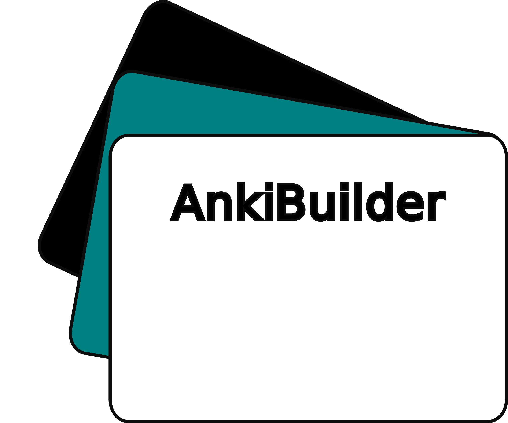
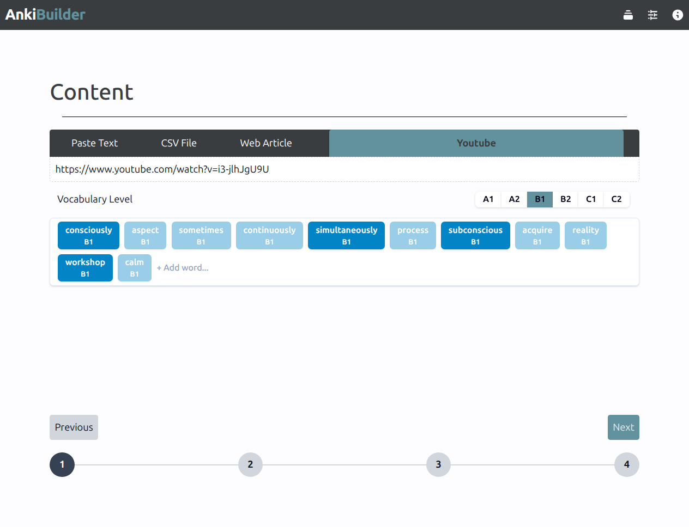
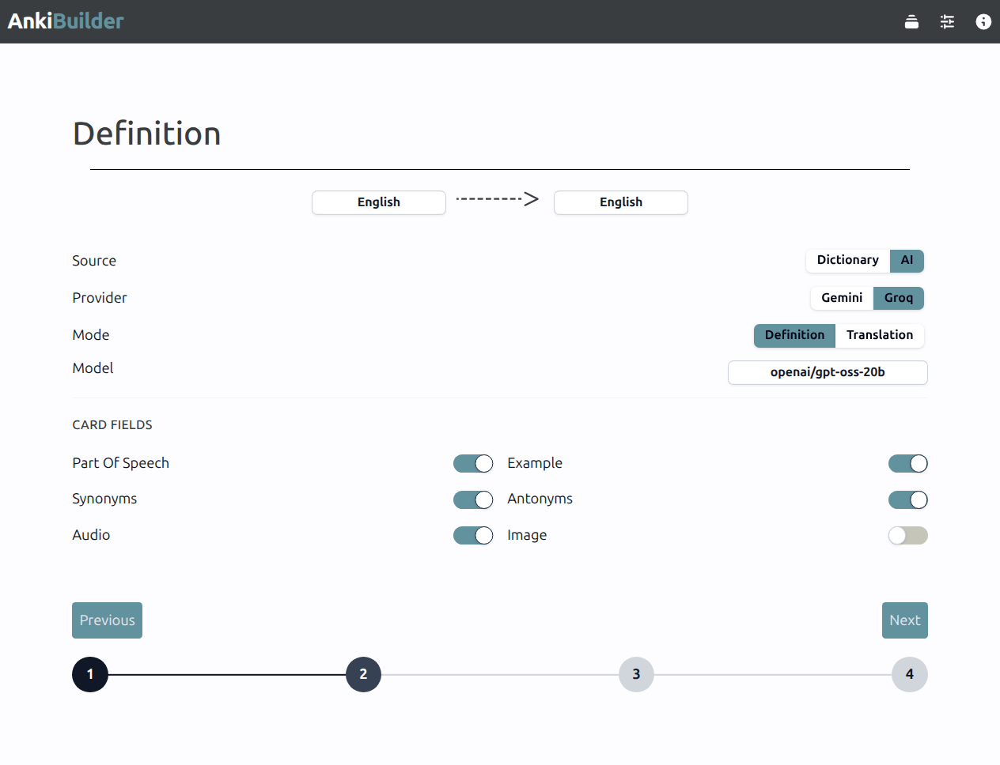
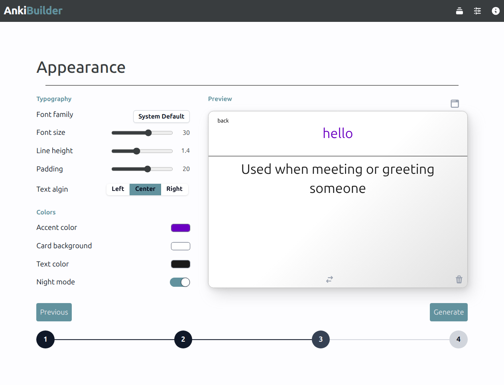
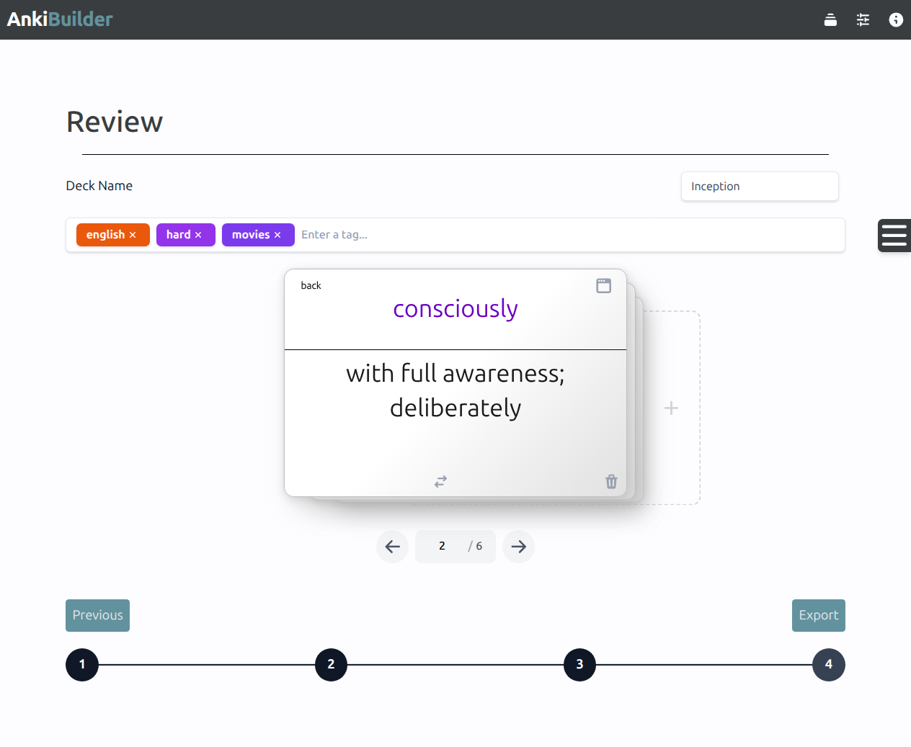
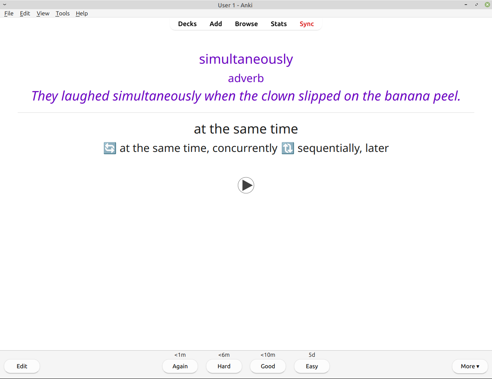

# AnkiBuilder

<p align="center">
  
</p>
---


A web app that turns your content into ready-to-use Anki flashcard decks — effortlessly.

Provide words from any source, customize how they look, and export a `.apkg` file straight into Anki with definitions, pronunciations, and examples included.

## How It Works

| Step 1 | Step 2 |
|--------|--------|
| <br>Add your content using any supported source: paste text, upload a CSV, or enter a YouTube or article URL. | <br>Configure how definitions are generated: choose between AI or dictionary sources, set your language pair, and select which fields to include on each card. |

| Step 3 | Step 4 |
|--------|--------|
| <br>Customize the appearance of your cards: font, colors, and text alignment. | <br>Review and edit the generated cards before exporting. Add, delete, or reorder cards as needed. |

| Result |
|--------|
| <br>Export a ready-to-use .apkg file and import it directly into Anki. |

## Features

### Content sources
- Paste a word list directly
- Upload a CSV file
- Extract vocabulary from a YouTube video transcript
- Extract vocabulary from a web article

### Definition sources
- **AI** — natural, context-aware definitions using Groq or Gemini (bring your own API key)
- **Dictionary** — precise dictionary definitions via Free Dictionary API or Wordnik

### Card customization
- Choose which fields appear on each card: definition, example, synonyms, antonyms, part of speech, audio, and image
- Two modes: English definition or translation to a target language
- Fully customizable card appearance: font, size, colors, text alignment, and dark mode

### Audio & images
- Google Text-to-Speech for pronunciation audio
- Dictionary audio pronunciations (Free Dictionary API & Wordnik)
- Pictogram images for visual learners

### Export
- Exports standard `.apkg` files compatible with Anki on all platforms
- Add deck tags before exporting for easy organization in Anki

## API Keys

AnkiBuilder uses external providers to generate card content, images, and audio. Some providers require an API key, while others can be used without one.

API keys are entered on the Settings page and stored locally in your browser, synced to a temporary server session when you run the app. Keys are never stored in a database — the app only uses them for the current session.

| Provider | Required | How to get one |
|----------|----------|----------------|
| Gemini | Yes | [Google AI Studio](https://aistudio.google.com/app/apikey) |
| Groq | Yes | [Groq Console](https://console.groq.com/keys) |
| Wordnik | Yes | [Wordnik Developer Portal](https://developer.wordnik.com/) |
| Free Dictionary API | No | No API key required |

> **Note:** You only need an API key for the specific AI or dictionary providers you choose to enable in the app settings.

# Getting Started

Follow these steps to run Anki Builder locally.

## Prerequisites

Make sure you have the following installed:

- Python 3.12.3 or later
- Node.js 22.22.0 or later
- Git

## Installation

### 1. Clone the repository

```bash
git clone https://github.com/AmrGamalbit/anki-builder.git
cd anki-builder
```

### 2. Set up the backend

```bash
cd backend

python -m venv venv

# Linux/macOS
source venv/bin/activate

# Windows
venv\Scripts\activate

pip install -r requirements.txt
```

### 3. Set up the frontend

```bash
cd frontend
npm install
```

### 4. Configure environment variables

**Backend** — create a `.env` file inside the `backend` folder:

```env
SESSION_SECRET_KEY=your_secret_key_here
```

Generate a secret key by running:

```bash
python -c "import secrets; print(secrets.token_hex(32))"
```

**Frontend** — create a `.env` file inside the `frontend` folder:

```env
VITE_API_URL=http://localhost:8000
```

> Replace `http://localhost:8000` with your backend URL if running on a different host or port.

## Running the application

Open **two terminals**.

### Terminal 1 — Backend

```bash
cd backend

# Linux/macOS
source venv/bin/activate

# Windows
venv\Scripts\activate

uvicorn main:app --reload
```

The backend will run at:

```
http://localhost:8000
```

### Terminal 2 — Frontend

```bash
cd frontend
npm run dev
```

The frontend will run at:

```
http://localhost:5173
```

Open the frontend URL in your browser to start using the application.

## Tech stack

- **Frontend:** Vue 3 (Composition API), Tailwind CSS, Pinia
- **Backend:** FastAPI, Python
- **Card generation:** genanki
- **AI providers:** Groq, Gemini (Google Gen AI)
- **Dictionary providers:** Free Dictionary API, Wordnik
- **Text-to-speech:** Google TTS (gTTS)
- **Image service:** Arasaac (pictograms)

## Project Structure

```text
anki-builder/
├── assets/                # README media & documentation assets
│   ├── logo.png
│   └── screenshots/       # Application demo images
│
├── backend/               # FastAPI backend
│   ├── app/               # Main application package
│   │   ├── core/          # Logic to dispatch and register definition providers
│   │   ├── models/        # Pydantic models for requests and responses
│   │   ├── routers/       # API endpoints and route handlers
│   │   ├── services/      # Logic for card generation, audio/image fetching, and text extraction
│   │   ├── sources/       # Provider integrations for dictionaries and AI
│   │   └── utils/         # Helper utility functions
│   ├── main.py            # FastAPI entry point
│   └── requirements.txt   # Python dependencies
│
├── frontend/              # Vue.js frontend
│   ├── src/
│   │   ├── api/           # API request functions
│   │   ├── assets/        # Global styles, fonts, and images
│   │   ├── components/    # Reusable UI components
│   │   ├── router/        # Vue Router configuration
│   │   ├── stores/        # Pinia / State management stores
│   │   ├── types/         # TypeScript interfaces and types
│   │   ├── views/         # Application pages/routes
│   │   ├── App.vue        # Root Vue component
│   │   └── main.js        # Frontend entry point
│   ├── public/            # Static public assets
│   └── package.json       # Node dependencies and scripts
│
├── README.md
└── LICENSE
```

## License
This project is licensed under the **MIT License** — see the [LICENSE](LICENSE) file for details.

*Note: Third-party API providers integrated into AnkiBuilder (such as Google Gemini, Groq, and Wordnik) are subject to their respective terms of service and usage policies.*
